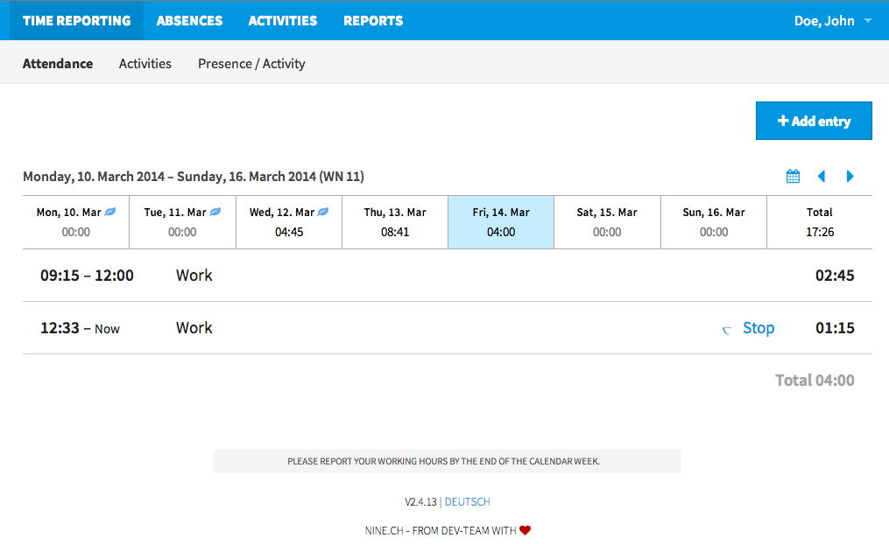

# uberZeit

Time and activity tracking web application for the rest of us.

## Features

### Time Reporting

### Absences Management

## Installation on your production server

The installation has been tested on Ubuntu 12.04 and Debian GNU/Linux 7.4 (wheezy).

### Packages / Dependencies

#### For Ubuntu 12.04 and Debian GNU/Linux 7.4

    apt-get update
    apt-get install libxml2 libxml2-dev libxslt1-dev libcurl4-openssl-dev ruby1.9.1 ruby1.9.1-dev postgresql-9.1 libpq-dev git build-essential

Install RubyGems from https://rubygems.org. Do not use the `rubygems` package from the repository as it's outdated and only works on Ruby 1.8. Then:

    gem install bundler

### Setup

#### Clone repository

    cd /to/installation/directory
    git clone https://github.com/ninech/uberzeit.git .

#### Install required Gems

    bundle install --without development test --deployment

#### Setup database

    cp config/database.yml.example config/database.yml

Now add a database user and adjust database.yml accordingly.
Then set up the database:

    RAILS_ENV=production bundle exec rake db:create db:schema:load db:seed

#### Precompile assets

    RAILS_ENV=production bundle exec rake assets:precompile

#### Copy initial app settings

    cp config/uberzeit.yml.example config/uberzeit.yml

#### Setup environment variables

    cp .env.example .env

Edit `.env` and change the value of `SECRET_TOKEN` to a random alphanumeric string.
You could for example use `pwgen -s -1 100` to generate a random string.

#### Start the app

    RAILS_ENV=production bundle exec thin start -e production

Now visit http://hostname:3000 and sign in with `admin@example.org`, password `admin`. Enjoy!

## Deployment on Heroku

To deploy on Heroku, some some modifications are required. The configuration
must also be added to the repository.
We do this using the hidden branch `deploy` which will be pushed to Heroku only.

### Clone repository

    cd /to/installation/directory
    git clone https://github.com/ninech/uberzeit.git .

### Set up Heroku

    heroku create
    git checkout -b deploy

### Configure

    cp config/uberzeit.yml.example config/uberzeit.yml
    # Edit config/uberzeit.yml to fit your needs
    git add -f config/uberzeit.yml
    git commit -m 'add configuration'
    heroku config:set SECRET_TOKEN=`pwgen -s -1 100`

### Deploy To Heroku

    git push heroku deploy:master
    heroku run rake db:schema:load db:seed
    heroku open

Sign in with `admin@example.org`, password `admin`. Enjoy!

## API

    curl -v -H 'X-Auth-Token: YourSuperSecretToken' -X GET uberzeit.dev/api/ping

## 3rd Party Integrations

* [Presence for uberZeit Mac OS X](http://crafted.ch/presence) - Mac OS X menubar app to manage your uberZeit timers
* [Presence for uberZeit iOS](https://itunes.apple.com/ch/app/presence-for-uberzeit/id890649751) - iOS app to manage your uberZeit timer

## Screencasts

* [uberZeit -Time Tracking Done Right by Dieter Mannheim](https://db.tt/aobrLMsr)

## License

uberZeit is released under the [MIT License](http://www.opensource.org/licenses/MIT). See LICENSE.txt for further details.
